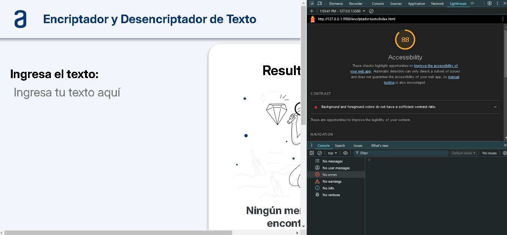

# encriptador-texto

## Challenge Encriptador de Texto - ALURA LATAM

La aplicación Encriptador y Desencriptador de Texto es una herramienta interactiva diseñada para transformar texto en una versión encriptada y viceversa. Utiliza un algoritmo simple de sustitución de caracteres para codificar y decodificar mensajes. Ideal para quienes buscan una solución rápida para encriptar mensajes o para propósitos educativos relacionados con la criptografía básica.
Por ultimo cabe mencionar que para darle algo adicional al proyecto se coloco un button "Reiniciar" que permite limpiar el impur y output del proyecto para ingresar otro texto.

### Autor: Omar Alexis Torbisco Pizarro

### Enlaces y Recursos

* [Repositorio encriptador-texto](https://github.com/omartpiza/encriptador-texto)

* [Pagina Encriptador de Texto](https://omartpiza.github.io/encriptador-texto)

### Puntuación de Accesibilidad de Lighthouse

* 